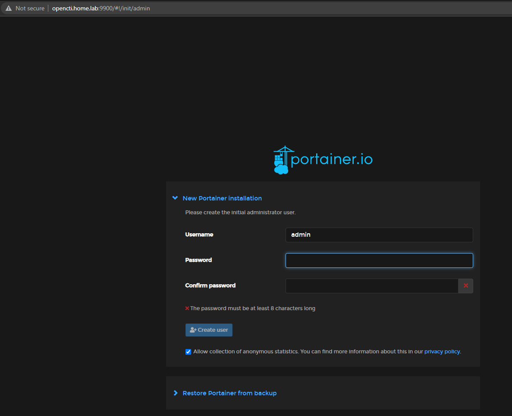
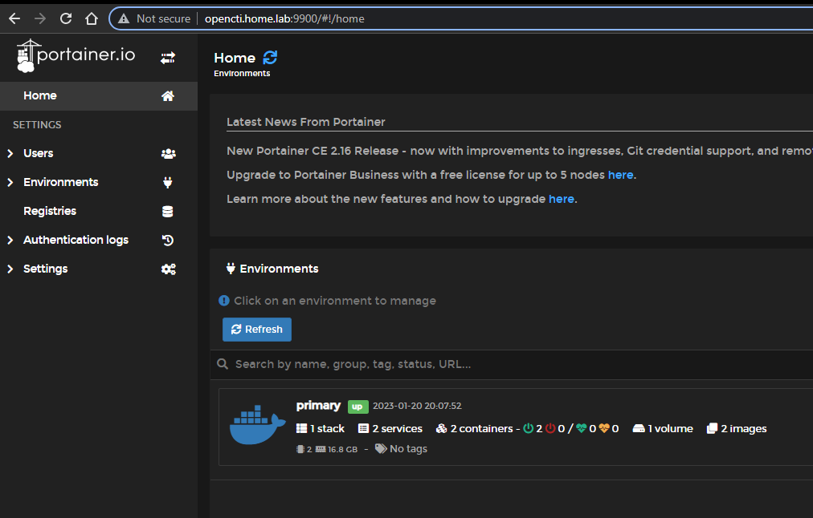
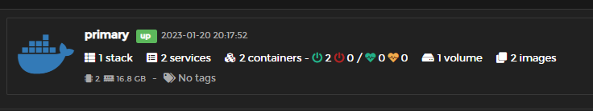
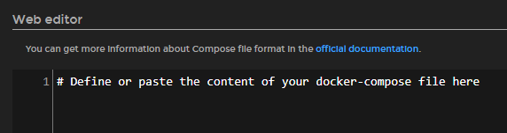
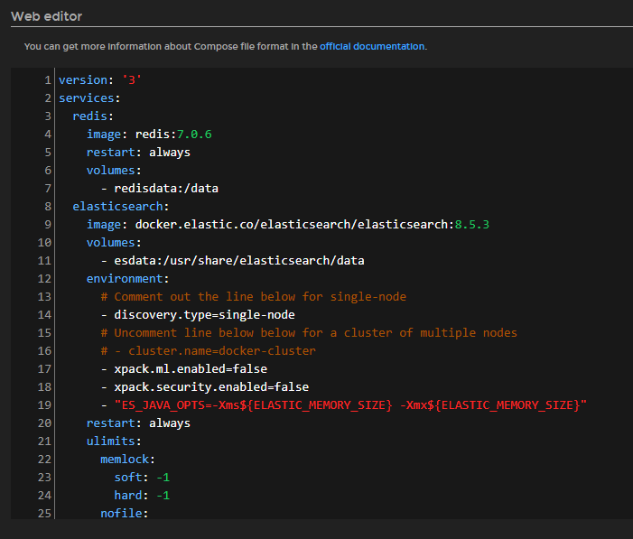
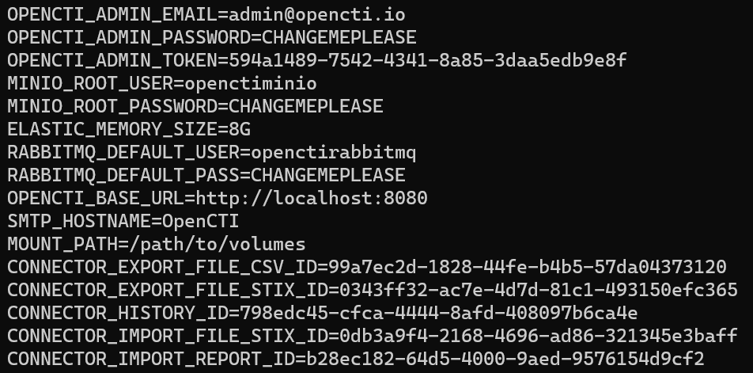
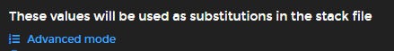
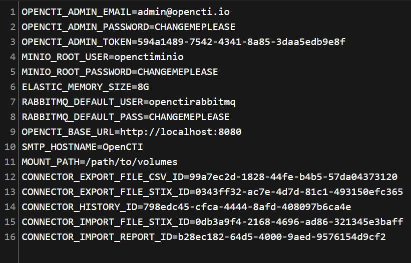
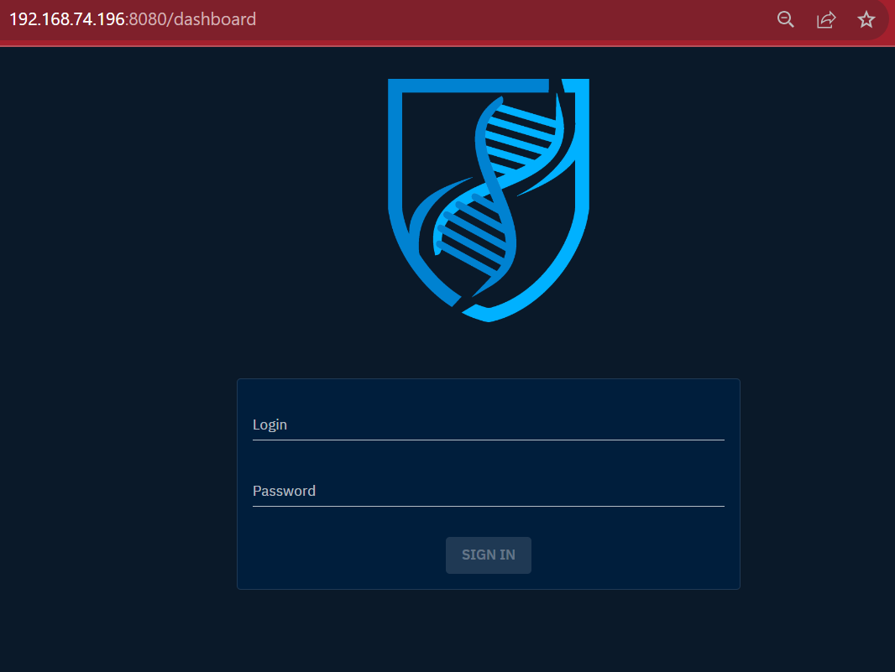
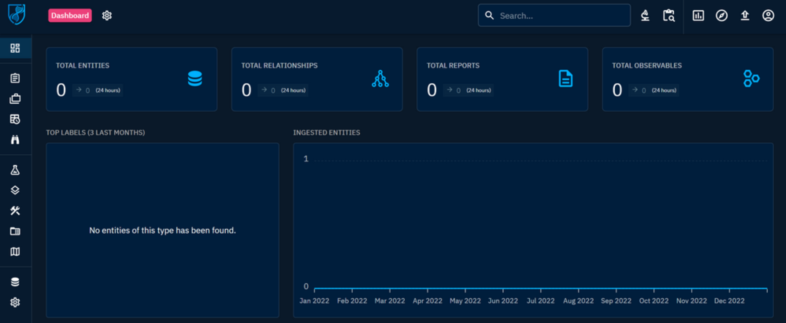

# OpenCTI - deploy
<p align="center"></p>


## Problems in Iran
#### To bypass Docker ban:
1.  [shecan dns](https://shecan.ir)
2. **docker registry mirrors**
    > add the following text to **/etc/docker/daemon.json**
    ```
    {
        "registry-mirrors": ["URL"]
    }
    ```
    After this you need to restart Docker
    ```
    $ systemctl daemon-reload 
    $ systemctl restart docker 
    ```

    > or you can pulling like this
    ```
    $ docker pull "URL"/<IMAGE NAME>
    ```

    ---
     **you can use following URL**

    "https://docker.dockerme.ir" "https://registry.docker.ir" "https://docker.nowire.ir"
  

## Install 
[OpenCTI documentation](https://docs.opencti.io/5.8.X/deployment/installation/#using-docker)

[More documentation](https://benheater.com/proxmox-running-opencti/)

### Install portainer
```
$ mkdir -p /path/to/volumes
$ echo "export MOUNT_PATH=/path/to/volumes" >> ~/.bashrc
```
```
$ apt install curl
$ mkdir -p /opt/portainer && cd /opt/portainer
$ curl -sL https://downloads.portainer.io/portainer-agent-stack.yml -o portainer-agent-stack.yml
```
<br />
<br />


Edit a few Portainer variables to prevent any clashes with TCP port bindings.

```
$ vim portainer-agent-stack.yml
```
<br />

```
ports:
      - "9443:9443"
      - "9000:9000"
      - "8000:8000"
```
<p style="text-align: center;color:gray">Before</p>

```
ports:
      - "9443:9443"
      - "19000:9000"
      - "18000:8000"
```
<p style="text-align: center;color:green">After</p>

<br />
<br />

Add volume.

```
volumes:
  portainer_data:
```
<p style="text-align: center;color:gray">Before</p>

```
volumes:
  portainer_data:
    driver: local
    driver_opts:
      type: none
      o: bind
      device: ${MOUNT_PATH}/portainerdata
```
<p style="text-align: center;color:green">After</p>
<br />

Make volume's directory 
```
$ mkdir $MOUNT_PATH/portainerdata
$ chmod 775 $MOUNT_PATH/portainerdata

```
<br />

#### Deploy Portainer

```
$ docker swarm init
$ docker stack deploy --compose-file=portainer-agent-stack.yml portainer
```

**Connect to your Portainer instance at http://ip:19000**

<br />
<br />

<p align="center"><br /></p>

Go ahead and set up a new password for the admin user and save it in your password vault. Once your password is set, you should be redirected to the Portainer dashboard.

<p align="center"><br /></p>

<br />

---

### Add a Docker Stack for OpenCTI

<p align="center"><br />Click on 'primary'</p>
<p align="center"><br /></p>
<p align="center"><br /></p>
<p align="center"><br /></p>
<br />


#### Add the Docker-Compose Configuration
<p align="center"><br />We are going to paste the official docker-compose.yml configuration here</p>

<br />

> Copy the contents of the [docker-compose.yml](https://github.com/OpenCTI-Platform/docker/blob/master/docker-compose.yml) file in the official GitHub repo

<p align="center"></p>

If you want the application to load on port 80, change the following value in the opencti block.

```
8080:8080
```
<p style="text-align: center;color:gray">Before</p>

```
80:8080
```
<p style="text-align: center;color:green">After</p>
<br />

Add the following in the rabbitmq environment section.

```
rabbitmq:
    image: rabbitmq:3.12-management
    environment:
      - RABBITMQ_DEFAULT_USER=${RABBITMQ_DEFAULT_USER}
      - RABBITMQ_DEFAULT_PASS=${RABBITMQ_DEFAULT_PASS}
      - RABBITMQ_NODENAME=rabbit01@localhost
```
<p style="text-align: center;color:gray">Before</p>

```
rabbitmq:
    image: rabbitmq:3.12-management
    environment:
      - RABBITMQ_DEFAULT_USER=${RABBITMQ_DEFAULT_USER}
      - RABBITMQ_DEFAULT_PASS=${RABBITMQ_DEFAULT_PASS}
      - RABBITMQ_DEFAULT_VHOST=/
      - RABBITMQ_DEFAULT_USER_TAGS=administrator
      - RABBITMQ_NODENAME=rabbit01@localhost
```
<p style="text-align: center;color:green">After</p>
<br />

set your volume.

```
volumes:
  esdata:
  s3data:
  redisdata:
  amqpdata:
```
<p style="text-align: center;color:gray">Before</p>

```
volumes:
  esdata:
    driver: local
    driver_opts:
      type: none
      o: bind
      device: ${MOUNT_PATH}/esdata

  s3data:
    driver: local
    driver_opts:
      type: none
      o: bind
      device: ${MOUNT_PATH}/s3data

  redisdata:
    driver: local
    driver_opts:
      type: none
      o: bind
      device: ${MOUNT_PATH}/redisdata

  amqpdata:
    driver: local
    driver_opts:
      type: none
      o: bind
      device: ${MOUNT_PATH}/amqpdata
```
<p style="text-align: center;color:green">After</p>
<br />

Make volume's directory.
```
$ cd $MOUNT_PATH
$ mkdir s3data redisdata amqpdata esdata
$ chmod 775 *
``````
<br />

#### Configure Environment Variables
Generate some environment variables by running this command:

```
cat << EOF
OPENCTI_ADMIN_EMAIL=admin@opencti.io
OPENCTI_ADMIN_PASSWORD=CHANGEMEPLEASE
OPENCTI_ADMIN_TOKEN=$(cat /proc/sys/kernel/random/uuid)
MINIO_ROOT_USER=openctiminio
MINIO_ROOT_PASSWORD=CHANGEMEPLEASE
ELASTIC_MEMORY_SIZE=8G
RABBITMQ_DEFAULT_USER=openctirabbitmq
RABBITMQ_DEFAULT_PASS=CHANGEMEPLEASE
OPENCTI_BASE_URL=http://localhost:8080
SMTP_HOSTNAME=$(hostname)
MOUNT_PATH=/path/to/volumes
CONNECTOR_EXPORT_FILE_CSV_ID=$(cat /proc/sys/kernel/random/uuid)
CONNECTOR_EXPORT_FILE_STIX_ID=$(cat /proc/sys/kernel/random/uuid)
CONNECTOR_HISTORY_ID=$(cat /proc/sys/kernel/random/uuid)
CONNECTOR_IMPORT_FILE_STIX_ID=$(cat /proc/sys/kernel/random/uuid)
CONNECTOR_IMPORT_REPORT_ID=$(cat /proc/sys/kernel/random/uuid)
EOF
```

You should see some environment variables print to the terminal screen:

<p align="center"></p>

Copy the output to your clipboard.

<p align="center"><br />Click 'Advanced mode'
</p>

Paste your environment variables in the input box:

<p align="center"></p>

> &#9888; Some variables are just placeholders and need to be changed. Please update the following variables:

- OPENCTI_ADMIN_EMAIL
  - Used to log into OpenCTI
  - Also, used for system and other alerts

<br />

- OPENCTI_ADMIN_PASSWORD
  - Password to log into OpenCTI
  - Change this and store in a password vault
  
<br />

- OPENCTI_BASE_URL
  - clear port if you use web app in port 80
  - Change localhost to your FQDN or IP address
  - Example: http://10.148.148.3 or http://opencti.home.lab

<br />

- MINIO_ROOT_PASSWORD
  - Change this and store in a password vault

<br />

- RABBITMQ_DEFAULT_PASS
  - Change this and store in a password vault

<br />

- MOUNT_PATH
  - Change to the path you used for MOUNT_PATH

<br />

Configuration is complete. We can now deploy the Docker configuration.

<p align="center"></p>

> At your initial deployment of the stack -- and with any subsequent updates to the stack -- you may need to wait a several minutes for all of the Docker components to initialize. <br /><br />If the OpenCTI interface is not immediately available, be patient.

<br />

---

### Logging into OpenCTI

In your web browser, navigate to http://ipaddress:8080 or http://fqdn:8080. Remember, We configured the application on port 8080. If you set it to 80, don't write the port.

<p align="center"><br />The username and password were set by you in the Environment Variables configuration.
<br />
[OPENCTI_ADMIN_EMAIL], [OPENCTI_ADMIN_PASSWORD]</p>

<br />

<p align="center"></p>

<br />

**Upon first glance, the empty canvas on the OpenCTI UI can be a little underwhelming. OpenCTI does not ship with any data, so you either have to import it manually or use connectors to programmatically pull data.**

---

### Configuring OpenCTI Connectors

A list of officially supported [connectors](https://benheater.com/proxmox-running-opencti/) (and their configurations) is available on their GitHub repo.

<br />

Connectors are divided into several categories:
- External Import
- Internal Enrichment
- Internal Export File
- Internal Import File
- Stream
---
